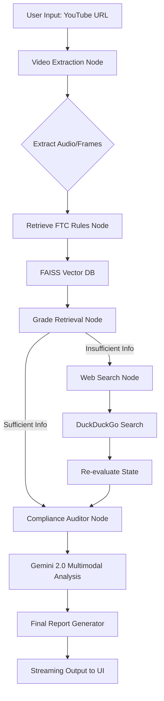

# Multimodal FTC Compliance Agent

A production-grade, multi-agent system designed to audit YouTube content for FTC disclosure compliance. The system utilizes LangGraph for agentic orchestration, Gemini 2.0 Flash for multimodal reasoning, and FastAPI for real-time streaming of the audit process.

---

##  Live Access

- Interactive Web App:  
  https://multimodal-compliance-agent-hofgxhi5lzlxjr6k8pecky.streamlit.app/

- API Documentation:  
  https://swdqwewfw-ftc-compliance-agent.hf.space/docs#/

- Backend Infrastructure:  
  Dockerized on Hugging Face Spaces  

---

## Demo
.png)


##  System Architecture (CRAG Agent)

The core engine is a Corrective Retrieval-Augmented Generation (CRAG) agent. It evaluates the quality of retrieved policy data and dynamically falls back to web search when local knowledge is insufficient.



---

## Tech Stack

- Orchestration: LangGraph (Stateful Multi-Agent Workflows)  
- LLM: Google Gemini 2.0 Flash (Multimodal reasoning for video, audio, and text)  
- Vector Store: FAISS (Local semantic retrieval over FTC policy documents)  
- Backend: FastAPI (Asynchronous, streaming-first API design)  
- Frontend: Streamlit (Real-time logs and audit visualization)  
- Extraction Pipeline: yt-dlp (video ingestion), MoviePy (audio/frame processing)  
- Deployment: Docker on Hugging Face Spaces, Streamlit Cloud for frontend  

---

##  Local Setup & Installation

### 1. Prerequisites

- Python 3.12+  
- FFmpeg installed (required for video/audio processing)  
- Google Gemini API Key  

---

### 2. Clone & Install

```bash
git clone https://github.com/DataWorshipper/multimodal-compliance-agent.git
cd multimodal-compliance-agent

pip install -r requirements.txt
```

---

### 3. Environment Configuration

Create a `.env` file in the root directory:

```env
GOOGLE_API_KEY=your_gemini_api_key_here
```

---

### 4. Running the System

#### Start Backend (FastAPI)

```bash
uvicorn backend.src.api.server:app --host 0.0.0.0 --port 8080
```

#### Start Frontend (Streamlit)

```bash
streamlit run frontend/app.py
```

---

## API Usage

### POST /stream_analyze

Description:  
Streams the full agent workflow including retrieval, evaluation, and final compliance report.

Request Body:

```json
{
  "url": "https://www.youtube.com/watch?v=..."
}
```

Response:
- Streaming text output (logs + final report)  
- Designed to handle long-running multimodal processing without timeout  

---

## System Design Highlights

- Streaming-first architecture prevents request timeouts during long video processing  
- CRAG loop dynamically evaluates retrieval quality before prceeding  
- Fallback web search ensures robustness when local knowledge is insufficient  
- Multimodal reasoning combines:
  - Audio transcription  
  - OCR from video frames  
  - Metadata analysis  

---

## Future Improvements

- Persistent vector database (external storage instead of rebuild)  
- Caching layer for repeated video audits  
- Support for additional compliance frameworks (ASA, GDPR disclosures)  
- Parallelized frame/audio processing for faster inference  
- UI improvements for structured report visualization  

---

##  Notes

- FAISS indices and raw documents are not stored in the repository; they are generated or fetched at runtime  
- Designed to run in constrained environments like Hugging Face Spaces using Docker  
- Streaming endpoint is critical for production reliability  
